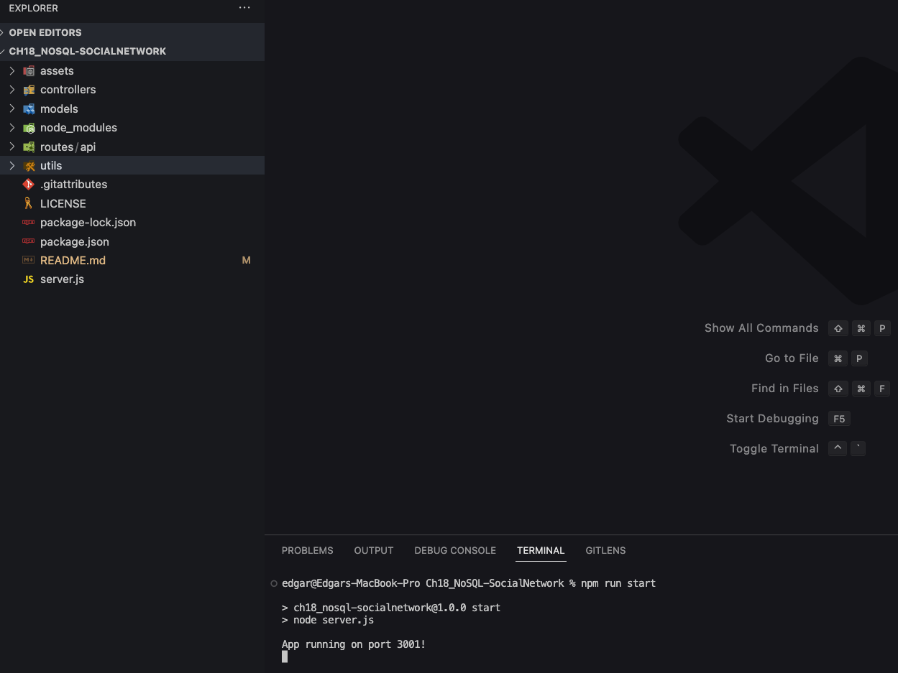
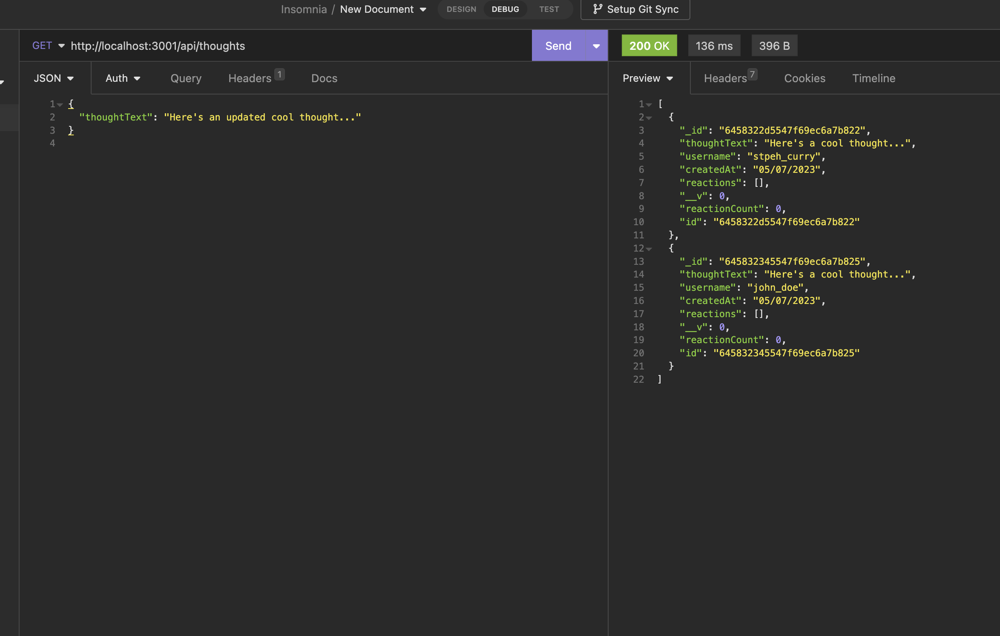

# Ch18_NoSQL-SocialNetwork

This project uses the following technologies:

- Node.js
- Express.js
- MongoDB
- Mongoose
- Insomnia

## Description

This project is a Social Network API that powers a web-based social media platform, enabling users to interact and share content seamlessly. The API is built using Node.js, Express.js, and MongoDB, providing a fast and flexible solution capable of handling large amounts of unstructured data. As the backbone of a full-stack social media application, this API supports user registration, content sharing, and friend list management, while also offering robust data retrieval and manipulation capabilities. The Social Network API lays the groundwork for an efficient and scalable social media experience, setting the stage for future front-end development and seamless user interactions.

## Table of Contents

- [Installation](#installation)
- [Usage](#usage)
- [Credits](#credits)
- [Tests](#tests)

## Installation

1. Clone this repository or download the source code.
2. Install `Node.js` if you haven't already.
3. Install `MongoDB` and ensure the database service is running.
4. Open a terminal/command prompt and navigate to the project folder.
5. Run `npm install` to install the required dependencies.

Review the code on the GitHub repository by visiting the [GitHub Repository](https://github.com/etapm/M19_TextEditor).

## Usage

1.  To start the application, navigate to the project root directory and run `npm run start`.

    

2.  Open Insomnia or your preferred API testing tool.

    

## Credits

N/A

## License

N/A

## Badges

N/A

## Features

N/A

## How to Contribute

N/A

## Tests

To run tests for this project, follow these steps:

1. Ensure you have installed all required dependencies by running npm install.
2. Ensure your MongoDB service is running.
3. In the terminal/command prompt, run npm test to execute the test suite.
